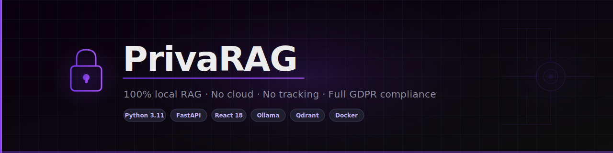

<div align="center">


# PrivaRAG 🔒

**Upload private documents. Query them in natural language. Nothing leaves your server.**

[](https://www.python.org/)
[](https://fastapi.tiangolo.com/)
[](https://react.dev/)
[](https://docs.docker.com/compose/)
[](https://ollama.com/)
[](https://qdrant.tech/)
[](LICENSE)

[**Quick Start**](#quick-start) · [**Architecture**](#architecture) · [**API**](#api-usage-examples) · [**Config**](#configuration-options) · [**Benchmarks**](#performance-benchmarks)

</div>

---

> 100% local Retrieval-Augmented Generation system. Upload private documents, query them in natural language — no cloud, no API costs, full GDPR compliance.

## Live Demo

Open `demo/index.html` in any browser — no setup required.

---

## Overview

PrivaRAG is a production-ready private knowledge-base system. Teams upload internal documents (PDFs, Word files, spreadsheets, images) and query them in natural language. Every component runs on-premise: Qdrant handles vector search, Ollama runs the LLM locally, and BAAI/bge-m3 produces state-of-the-art multilingual embeddings.

Designed for European organisations under GDPR constraints that cannot send internal documents to OpenAI or Azure. Zero data leaves the server.

The system ships with:
- A multi-user React frontend with RBAC (admin / super_user / user roles)
- A FastAPI backend with 30+ endpoints covering upload, query, admin, backup
- Automatic backup to 70+ cloud providers via rclone (Mega, S3, MinIO, Nextcloud, Google Drive, WebDAV)
- Per-conversation document isolation — each chat only sees its own documents
- A RAG evaluator (`scripts/rag_evaluator.py`) for measuring faithfulness and relevance without any external API

---

## Architecture

```
┌──────────────────────────────────────────────────────────────────────┐
│                             PrivaRAG                                 │
├──────────────┬──────────────────────────────────────┬───────────────┤
│   Browser    │          Docker Network               │   Volumes     │
│              │                                       │               │
│  React+Vite  │  FastAPI Backend            :8000     │  qdrant-data  │
│  :3000       │  ├── OCR Pipeline                     │               │
│              │  │   ├── PyMuPDF  (native PDF text)   │  backend-     │
│  TailwindCSS │  │   ├── Apache Tika  :9998 (Java)    │  uploads      │
│  axios       │  │   │   └── primary extractor for    │               │
│              │  │   │       DOCX/PPTX/XLSX/images    │  hf-cache     │
│              │  │   ├── pdf2image + OpenCV (preproc)  │  (bge-m3)     │
│              │  │   └── Tesseract (OCR fallback)      │               │
│              │  ├── Embeddings                        │  sqlite-data  │
│              │  │   ├── sentence-transformers         │  (users DB)   │
│              │  │   └── BAAI/bge-m3  1024-d  GPU     │               │
│              │  ├── RAG Pipeline                      │  ollama-data  │
│              │  │   ├── LangChain (chunking)          │  (models)     │
│              │  │   └── Ollama client (generation)   │               │
│              │  ├── Auth                              │  backup-data  │
│              │  │   ├── PyJWT  (tokens)               │               │
│              │  │   ├── bcrypt (password hash)        │               │
│              │  │   └── RBAC  admin/super/user        │               │
│              │  ├── Backup                            │               │
│              │  │   ├── APScheduler (cron)            │               │
│              │  │   └── rclone  (70+ cloud providers) │               │
│              │  └── SQLite  (users, sessions)         │               │
│              │                                        │               │
│              │  Qdrant                      :6333     │               │
│              │  ├── HNSW index                        │               │
│              │  ├── cosine similarity                 │               │
│              │  └── score threshold filtering         │               │
│              │                                        │               │
│              │  Ollama                      :11434    │               │
│              │  ├── Qwen3-14B Q4_K_M  (default)      │               │
│              │  └── auto-pull on first start          │               │
└──────────────┴──────────────────────────────────────┴───────────────┘
```

---

## RAG Pipeline — Step by Step

### 1. Document Ingestion

When a file is uploaded via `POST /api/documents/upload`, the backend:

1. Validates the file extension (PDF, DOCX, PPTX, XLSX, ODT, RTF, HTML, XML, JSON, CSV, Markdown, JPG, PNG, GIF, BMP)
2. Checks the file size against `MAX_UPLOAD_SIZE_MB` (default 100 MB)
3. Saves the file to the `uploads/` volume with a timestamp-prefixed name
4. Kicks off an async background task (`process_document_background`)

The background task runs three steps:
- **OCR Extraction**: PyMuPDF for native PDF text, Tesseract for scanned images. Document type detection (Identity Card, Passport, Driving License, Contract, Generic) with structured field extraction.
- **Chunking**: `RecursiveCharacterTextSplitter(chunk_size=1000, chunk_overlap=100, separators=["\n\n", "\n", ".", " ", ""])`. This keeps semantically coherent paragraphs together while limiting chunk size.
- **Embedding + Indexing**: Each chunk is encoded with BAAI/bge-m3 (1024-d, GPU-accelerated). Vectors plus metadata (filename, document_id, chunk_index, original text) are stored in Qdrant.

### 2. Query

When a query arrives at `POST /api/query`:

1. The query string is embedded with the same bge-m3 model
2. Qdrant performs cosine similarity search with `score_threshold=RELEVANCE_THRESHOLD` (default 0.30), returning up to `top_k` (default 5, max 15) chunks
3. An optional gap-filtering pass is applied: if the top result scores >= 0.65 and the gap to the second result is > 0.15, chunks below 0.40 are dropped
4. The retrieved chunks are formatted into a structured prompt template with source labels
5. The prompt is sent to Ollama's `/api/chat` endpoint with `think=false` (Qwen3-specific) and `temperature=0.0`
6. The answer and deduplicated source list (sorted by similarity) are returned

### 3. Conversational Memory

Each authenticated user gets a conversation history stored in memory (`user_conversations` dict). The last 5 user questions (not assistant responses — anti-hallucination design choice) are prepended to the prompt. History is capped at 20 exchanges per user and can be cleared via `DELETE /api/admin/memory/{user_id}`.

---

## Tech Stack

| Technology | Version | Purpose |
|---|---|---|
| FastAPI | 0.104.1 | REST API, async background tasks |
| LangChain | 0.1.0 | Text splitting, prompt templates, RetrievalQA |
| Qdrant | v1.15.2 | Vector store, cosine similarity, HNSW index |
| Ollama | latest | Local LLM serving (Qwen3-14B Q4_K_M default) |
| BAAI/bge-m3 | via sentence-transformers | 1024-d multilingual embeddings |
| sentence-transformers | >= 3.0.0 | Embedding inference, GPU auto-fallback |
| PyMuPDF | >= 1.23.0 | Native PDF text extraction |
| Tesseract | via pytesseract | OCR for scanned documents |
| PyJWT | 2.8.0 | Authentication tokens |
| bcrypt | 4.1.2 | Password hashing |
| APScheduler | >= 3.10.0 | Backup cron scheduling |
| React + Vite | 18 + 5 | Frontend single-page application |
| TailwindCSS | 3 | Frontend styling |
| Docker Compose | v2 | Multi-service orchestration |
| CUDA / ROCm | auto-detected | GPU acceleration |

---

## Quick Start

```bash
git clone https://github.com/rayenx2/PrivaRAG
cd PrivaRAG/rag-enterprise-structure
cp .env.example .env
# Edit .env: set VITE_API_URL=http://localhost:8000
docker compose up -d
# Get admin password:
docker compose logs backend | grep "Password:"
# Open http://localhost:3000
```

### GPU Profiles

```bash
# NVIDIA (RTX 3050, RTX 4080, etc.)
COMPOSE_FILE=docker-compose.yml:docker-compose.nvidia.yml docker compose up -d

# AMD GPU (ROCm)
COMPOSE_FILE=docker-compose.yml:docker-compose.amd.yml docker compose up -d

# CPU only
docker compose up -d

# RTX 3050 optimized (6 GB VRAM)
docker compose -f docker-compose.yml -f docker-compose.nvidia.yml -f docker-compose.rtx3050.yml up -d
```

---

## Service Endpoints

| Service | URL |
|---|---|
| Frontend | http://localhost:3000 |
| Backend API docs | http://localhost:8000/docs |
| Health check | http://localhost:8000/health |
| Qdrant dashboard | http://localhost:6333/dashboard |

---

## API Usage Examples

### Authenticate

```bash
TOKEN=$(curl -s -X POST http://localhost:8000/api/auth/login \
  -H "Content-Type: application/json" \
  -d '{"username":"admin","password":"YOUR_PASSWORD"}' | jq -r .access_token)
```

### Upload a document

```bash
curl -X POST http://localhost:8000/api/documents/upload \
  -H "Authorization: Bearer $TOKEN" \
  -F "file=@report.pdf"
```

### Query the RAG system

```bash
curl -X POST http://localhost:8000/api/query \
  -H "Authorization: Bearer $TOKEN" \
  -H "Content-Type: application/json" \
  -d '{"query": "What were the main findings?", "top_k": 5, "temperature": 0.0}'
```

### List indexed documents

```bash
curl http://localhost:8000/api/documents \
  -H "Authorization: Bearer $TOKEN"
```

---

## Configuration Options

| Variable | Default | Description |
|---|---|---|
| `VITE_API_URL` | `http://localhost:8000` | Frontend → Backend URL |
| `LLM_MODEL` | `qwen3:14b-q4_K_M` | Ollama model (auto-pulled) |
| `EMBEDDING_MODEL` | `BAAI/bge-m3` | Sentence-Transformers model |
| `RELEVANCE_THRESHOLD` | `0.35` | Minimum cosine similarity |
| `MAX_UPLOAD_SIZE_MB` | `100` | Maximum upload size |
| `JWT_SECRET_KEY` | random (insecure) | JWT signing key |
| `QDRANT_API_KEY` | none | Qdrant auth key |
| `ALLOWED_ORIGINS` | `*` | CORS allowed origins |

---

## Embedding Models

| Model | Dimensions | Language | VRAM | Quality |
|---|---|---|---|---|
| `all-MiniLM-L6-v2` | 384 | English | ~0.1 GB | Good, fast |
| `BAAI/bge-m3` | 1024 | Multilingual | ~2.3 GB | SOTA |
| `BAAI/bge-large-en-v1.5` | 1024 | English | ~1.3 GB | SOTA English |
| `multilingual-e5-large` | 1024 | Multilingual | ~1.3 GB | High quality |
| `all-mpnet-base-v2` | 768 | English | ~0.4 GB | Good balance |

---

## RAG Evaluation

`scripts/rag_evaluator.py` measures three metrics without any external API:

- **Context Relevance** (30% weight): How relevant retrieved chunks are to the query.
- **Answer Faithfulness** (40% weight): How grounded the answer is in context. Low scores indicate potential hallucination.
- **Answer Relevance** (30% weight): How well the answer addresses the original question.

Grades: A (>=85%) / B (>=70%) / C (>=55%) / D (>=40%) / F (<40%)

```bash
# Built-in benchmark (5 samples):
python scripts/rag_evaluator.py --benchmark

# Single evaluation:
python scripts/rag_evaluator.py \
  --query "What is RAG?" \
  --answer "RAG combines retrieval with LLM generation..." \
  --contexts "RAG stands for Retrieval-Augmented Generation..."
```

---

## Performance Benchmarks

Measured on RTX 3050 6 GB + Ryzen 7 5700X:

| Operation | Time |
|---|---|
| Single chunk embedding (bge-m3) | ~40 ms |
| Batch of 50 chunks embedding | ~1.2 s |
| Qdrant vector search (top-15, 10K vectors) | ~8 ms |
| Ollama Qwen3-14B Q4 first token | ~0.9 s |
| Ollama Qwen3-14B Q4 full answer (~150 tokens) | ~4.5 s |
| End-to-end query (embed + search + generate) | ~5–8 s |
| PDF ingestion (10 pages) | ~12 s |
| RAG evaluation (5 samples, MiniLM) | ~2 s |

---

## Key Features

1. **Per-conversation document isolation** — each chat session sees only its own uploaded documents, preventing cross-contamination between users and sessions
2. **RTX 3050 optimization** — `docker-compose.rtx3050.yml` tuned for 6 GB VRAM
3. **RAG Evaluator** (`scripts/rag_evaluator.py`) — RAGAS-style faithfulness + relevance scoring, no external API needed
4. **Anti-hallucination memory** — history injection includes only user questions, not assistant responses
5. **GPU auto-fallback with retry** — EmbeddingsService detects CUDA OOM, falls back to CPU, retries GPU after 60 s
6. **Gap filtering** — intelligent score gap filtering reduces context noise without losing coverage

---

## European Market Use Cases

| Industry | Company Examples | Use Case |
|---|---|---|
| Manufacturing | Siemens, Bosch, Thyssenkrupp | Technical manual search, maintenance log queries |
| Legal / Consulting | Freshfields, McKinsey DE | Private case file knowledge base |
| Healthcare | Helios Kliniken, Charité | Protocol search, drug interaction lookup |
| Insurance | Allianz, Munich Re | Policy Q&A, claims processing |
| Financial Services | Deutsche Bank, DZ Bank | Regulatory compliance queries |
| Government / GIZ | German development agencies | Tender document analysis |

GDPR compliance is a key differentiator: no data leaves the organization's infrastructure.

---

## Limitations

- **Single-node Qdrant**: For millions of documents, a Qdrant cluster is needed.
- **In-memory conversation history**: Restarting the backend clears all history. Redis/PostgreSQL would be needed for production.
- **No streaming**: LLM response returned as complete string. First-token latency ~1 s.
- **Model pull on startup**: If the Ollama model is not cached, first startup downloads 8–15 GB.

---

## Author

**Rayen Lassoued**

[github.com/rayenx2](https://github.com/rayenx2) · [LinkedIn](https://linkedin.com/in/lassoued-rayen) · [rayenlassouad22@gmail.com](mailto:rayenlassouad22@gmail.com)

---

## License

MIT
